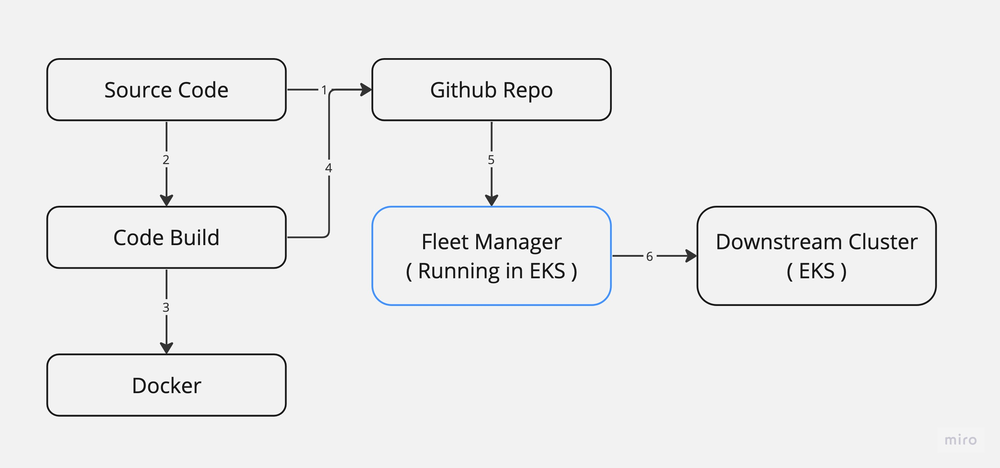

# CI-CD-Pipeline-
This repository holds the source code for a project that shows how to build a CI/CD pipeline using AWS CodeBuild for CI and Fleet as a GitOps tool to automate deployments to a Kubernetes cluster.



# Utilising Fleet GitOps and Terraform, create Kubernetes clusters.

You will want Kubernetes clusters for Fleet management and additional downstream clusters for deployments in order to have a complete CI/CD workflow. You may find the repository with the source code for setting up K8s clusters in EKS, GKE, and AKS here. For managing deployments to the other downstream clusters, Fleet may be installed on EKS. There is a README for this.

## Project Structure
```
├── README.md
├── IaC
```

## IaC (Terraform)
The *IaC* directory is mentioned in this section. The whole Terraform source code necessary to set up a CI pipeline using GitHub as the source and a CodeBuild project for the CI stage is contained in this file. The IAM permissions for the necessary service roles, as well as the S3 buckets for CodeBuild caching and CodePipeline source artefacts, are additional resources that are being generated. 

### Provisioning IaC

#### AWS Account & Profile
You need to have an AWS account and a profile configured with the AWS CLI on your workstation.

#### GitHub Personal Access Token & Docker Hub Account
You need to create a GitHub Personal Access Token with the relevant permissions for cloning and pushing to your profile's repo. You also need to create a Docker Hub account. 
Store both the GitHub PAT and your Docker Hub credentials in AWS Secrets Manager.

#### Keeping Sensitive Values in `sensitive.tfvars`

Before provisioning the infrastructure, you need to create a `sensistive.tfvars` file structure in the following way:
```
profile="your-aws-profile"
github_secret_name="your-github-secret-name"
docker_secret_name="your-dockerhub-credentials-secret-name"
```

#### Provision & Destroy Pipeline Infrastructure in AWS

```
terraform apply -var-file="sensitive.tfvars" -auto-approve
```

#### Destroy Infrastructure
```
terraform destroy -var-file="sensitive.tfvars" -auto-approve
```

## K8s
This section refers to the *k8s* directory. This folder contains two Kubernetes manifest files:
* Deployment (deployment.yaml) - This file is generated as part of the CI stage using kustomize and has the Pod container configurations for the new version pushed to Docker Hub. 
* Service (service.yaml) - Creates a service load balancer for the Node.js application. 

The *Fleet* manager should be configured to watch this folder for its deployments to the relevant downstream clusters. 

*Ideally, this folder should be in a separate repository.*
